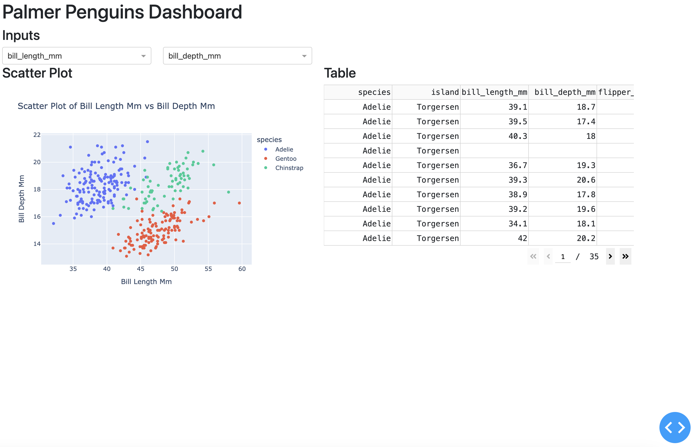

# Python apps

This repo contains three python apps using the [`palmerpenguins` dataset](https://pypi.org/project/palmerpenguins/).

```         
├── README.md
├── bokeh/
│   ├── README.md
│   ├── main.py
│   └── requirements.txt
├── dash/
│   ├── README.md
│   ├── app.py
│   └── requirements.txt
└── streamlit/
    ├── README.md
    ├── app.py
    └── requirements.txt

3 directories, 10 files
```

Instructions for publishing these apps can be found in the blog post titled, "**Python Apps:** Launching Python Applications from VS Code."

## Bokeh


## Streamlit


## Dash




